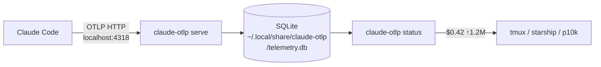

# claude-otlp-statusline

Local OTLP receiver that captures Claude Code telemetry and exposes it for statusline display.

## Problem

ccusage reads Claude Code JSONL session logs. Those logs have severe data quality issues (GitHub issue ryoppippi/ccusage#866): `input_tokens` undercounts by 100–174x, `output_tokens` by 10–17x. Only cache tokens are accurate. Cost estimates from ccusage can be 9x lower than actual.

## Solution

Claude Code emits accurate OTLP telemetry to `telemetry.googleapis.com`. The `api_request` events include a verbatim `cost_usd` field (same source as Claude Code's own statusbar). Instead of routing to GCP, receive OTLP locally, persist to SQLite, expose a fast statusline query command.

## Architecture

## Key OTLP fields (from telemetry-platform-poc POC)

`api_request` event labels (actual keys — dot notation matters):
- `cost_usd` — direct cost per request (no recalculation needed)
- `input_tokens`, `output_tokens`, `cache_read_tokens`, `cache_creation_tokens`
- `session.id` — aggregate per session (NOT `session_id` — underscore variant is wrong)
- `model`, `user_email`, `organization_id`

Event types observed: `api_request`, `tool_result`, `tool_decision`, `hook_execution_start`, `hook_execution_complete`

SQLite table: `api_requests`. Schema: `session_id, request_id, cost_usd, input_tokens, output_tokens, cache_read_tokens, cache_creation_tokens, model, ts`.

## Prior art

- `telemetry-platform-poc` — POC validating RFC-179 Option G (local Claude Code → GCP). Validated that `cost_usd` is accurate in OTLP stream. FINDINGS.md has full schema notes.
- ccusage — reads JSONL, severely undercounts. ryoppippi/ccusage#866 is the upstream bug report.

## GCP / infra

None. Fully local. SQLite only. No cloud dependency.

## Config

Never use `managed-settings.json` — all config in `settings.json` only.
All env vars (`CLAUDE_CODE_ENABLE_TELEMETRY`, `OTEL_LOGS_EXPORTER`, `OTEL_EXPORTER_OTLP_ENDPOINT`, `OTEL_EXPORTER_OTLP_PROTOCOL`) go in `settings.json` `env` block.
`otelHeadersHelper` in `settings.json` points to a script that returns GCP auth headers as JSON — Claude Code calls it before each OTLP export and attaches the headers to requests (including to localhost:4318).
`CLAUDE_OTLP_FORWARD_ENDPOINT` is read by the `serve` process, not Claude Code — set it in the daemon's env (launchd plist `EnvironmentVariables`, or shell export), NOT in `settings.json`.
GCP forwarding works by passing the incoming request headers through unchanged — the Bearer token from `otelHeadersHelper` is already present in the request arriving at localhost:4318.
Binary installs to `~/.local/bin/` via `go build -o ~/.local/bin/claude-otlp ./cmd/claude-otlp`.

## Session ID

`CLAUDE_CODE_SESSION_ID` env var is always set by Claude Code — use it directly. `status session` reads from stdin JSON (`session_id` field) first, falls back to env var, then JSONL walk.

## Debugging

Run daemon foreground (captures live payloads): `_CLAUDE_OTLP_DAEMON=1 ~/.local/bin/claude-otlp serve --addr localhost:4318`
`serve` self-daemonizes by default (exits if port already open); `--foreground` flag also bypasses.
