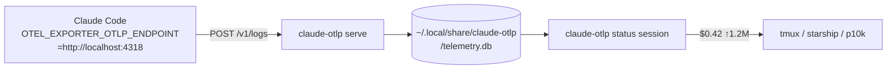

# claude-otlp-statusline

Local OTLP receiver that captures Claude Code telemetry and exposes it for statusline display.

## Why

`ccusage` reads Claude Code JSONL session logs to estimate cost. Those logs have fundamental data quality issues ([ryoppippi/ccusage#866](https://github.com/ryoppippi/ccusage/issues/866)): `input_tokens` undercounts 100–174x, `output_tokens` 10–17x. Real-world gap: ccusage reported ~$50 for a day where actual cost was ~$446.

Claude Code already emits accurate OTLP telemetry (`api_request` events with verbatim `cost_usd`). This tool intercepts that telemetry locally and exposes it as a one-line statusline command.

## Architecture



## Install

### 1. Build and install the binary

```bash
go install github.com/moritzschmitz-oviva/claude-otlp-statusline/cmd/claude-otlp@latest
```

Or build from source:

```bash
git clone https://github.com/moritzschmitz-oviva/claude-otlp-statusline
cd claude-otlp-statusline
go build -o ~/.local/bin/claude-otlp ./cmd/claude-otlp
```

### 2. Configure Claude Code to send telemetry locally

Add to `~/.claude/settings.json`:

```json
{
  "env": {
    "CLAUDE_CODE_ENABLE_TELEMETRY": "1",
    "OTEL_LOGS_EXPORTER": "otlp",
    "OTEL_EXPORTER_OTLP_ENDPOINT": "http://localhost:4318",
    "OTEL_EXPORTER_OTLP_PROTOCOL": "http/json"
  }
}
```

### 3. Start the daemon

`serve` self-daemonizes by default. Run it once to start it; it exits silently if already running:

```bash
claude-otlp serve
```

Logs go to `/tmp/claude-otlp.log`.

To verify it's running:

```bash
curl -s http://localhost:4318/v1/logs -d '{}'
```

## Usage

### Commands

```
claude-otlp serve                          # start OTLP receiver on localhost:4318
claude-otlp serve --addr localhost:4318    # custom listen address
claude-otlp serve --foreground             # run in foreground (skip daemonize)

claude-otlp status session                 # current-session cost + tokens (JSON)
claude-otlp status session --session <id>  # explicit session ID
claude-otlp status monthly                 # current-month cost + tokens (JSON)
claude-otlp status monthly --month 2026-05 # specific month (YYYY-MM)
```

### Output format

All `status` commands emit JSON:

```bash
$ claude-otlp status session
{"cost_usd":0.42,"session_id":"abc123","total_tokens":1234567}

$ claude-otlp status monthly
{"cost_usd":12.34,"month":"2026-06","total_tokens":45678901}
```

Prints `{}` when no data is available or the DB is missing — safe for statusline polling.

Session ID is auto-detected from `CLAUDE_CODE_SESSION_ID` (always set by Claude Code) or by walking `~/.claude/projects/**/*.jsonl` for the most recently modified session.

### Optional forwarding

`CLAUDE_OTLP_FORWARD_ENDPOINT` is read by the `serve` process itself, not by Claude Code — so it must be in the daemon's environment, not in `settings.json`.

```bash
export CLAUDE_OTLP_FORWARD_ENDPOINT=https://telemetry.googleapis.com
claude-otlp serve
```

## Statusline integration

All examples parse the JSON output with `jq`.

### tmux

```bash
# ~/.tmux.conf
set -g status-right "#(claude-otlp status session | jq -r '\"\\(.cost_usd | tostring | .[0:5]) ↑\" + (.total_tokens / 1000000 | tostring | .[0:4]) + \"M\"') | %H:%M"
```

Or use a helper script at `~/.local/bin/claude-cost`:

```bash
#!/usr/bin/env bash
claude-otlp status session | jq -r '"$\(.cost_usd) ↑\(.total_tokens)"' 2>/dev/null
```

```
set -g status-right "#(claude-cost) | %H:%M"
```

### Starship

```toml
[custom.claude_cost]
command = "claude-otlp status session | jq -r '\"$\\(.cost_usd)\"'"
when = "true"
shell = ["bash"]
format = "[$output]($style) "
style = "yellow"
```

### p10k (powerlevel10k)

```zsh
# In ~/.p10k.zsh, add a custom segment:
function prompt_claude_cost() {
  local cost
  cost=$(claude-otlp status session 2>/dev/null | jq -r '"$\(.cost_usd)"')
  [[ -n $cost ]] && p10k segment -f yellow -t "$cost"
}
```

## Validation

After a Claude Code session:

```bash
# Raw rows in SQLite
sqlite3 ~/.local/share/claude-otlp/telemetry.db \
  "SELECT session_id, SUM(cost_usd), SUM(input_tokens+output_tokens+cache_read_tokens+cache_creation_tokens) FROM api_requests GROUP BY session_id ORDER BY rowid DESC LIMIT 5"

# Query via binary (should match Claude Code's own statusbar cost)
claude-otlp status session

# Compare against ccusage (expect much lower cost from ccusage)
npx ccusage session
```

## DB location

`~/.local/share/claude-otlp/telemetry.db`

Table: `api_requests` — columns: `session_id`, `request_id`, `cost_usd`, `input_tokens`, `output_tokens`, `cache_read_tokens`, `cache_creation_tokens`, `model`, `ts`.
